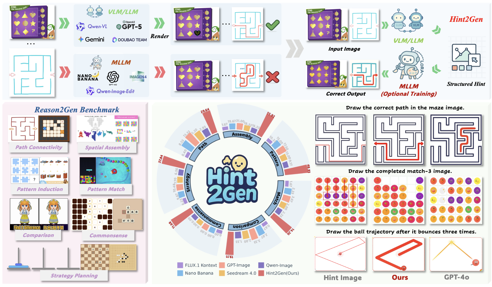

# Hint2Gen

Official repository for **Hint2Gen: Bridging Understanding and Generation via Code-structured Hints**.

Hint2Gen studies a core failure mode of current unified image generation models: they often fail on **reasoning-intensive visual tasks** even when VLMs or LLMs can solve the same tasks symbolically.  
Our key idea is to introduce **code-structured visual hints**, represented as lightweight **SVG/HTML overlays**, to bridge high-level reasoning and pixel-space image generation.



## Overview

The project contains two tightly connected parts:

- **Hint2Gen**: a hint-conditioned generation framework built on **FLUX.1 Kontext**
- **Reason2Gen**: a benchmark for reasoning-aware image generation and editing

Instead of treating reasoning as pure text, Hint2Gen uses structured visual programs as intermediate scaffolds. These hints explicitly encode reasoning steps on the image plane and make it easier for a generative model to produce spatially coherent, logically correct outputs.

> We are actively working on **Hint2Gen v2**, a next-stage version aimed at endowing the model with stronger explicit thinking and reasoning capabilities. More updates will be released soon. Stay tuned.

According to the paper, Reason2Gen contains:

- **3,300 samples**
- **22 categories**
- **7 core reasoning dimensions**

The seven reasoning dimensions include:

- path connectivity
- spatial assembly
- rule-based pattern induction
- detail comparison
- commonsense reasoning
- rapid elimination
- long-horizon strategic planning

## Paper

**Title**: Hint2Gen: Bridging Understanding and Generation via Code-structured Hints

## Released data

We provide the benchmark data and released outputs on Hugging Face:

- **Reason2Gen benchmark**
  https://huggingface.co/datasets/Tuyuanpeng/Reason2Gen

- **Reason2Gen_Full**
  https://huggingface.co/datasets/Tuyuanpeng/Reason2Gen_Full

- **Output_Reason2Gen**
  All method outputs on our largest evaluation set:
  https://huggingface.co/datasets/Tuyuanpeng/Output_Reason2Gen

## Repository structure

This repository currently focuses on the **hint generation** side of the pipeline.

- [hint_generate.py](./hint_generate.py): entrypoint for code-structured hint generation
- `reason2gen_hint/`: refactored implementation split into smaller modules
- [evaluation.py](./evaluation.py): a lightweight helper for inspecting released datasets

The `hint_generate.py` pipeline generates SVG/HTML-style visual hints using **GPT-5.4** and is intended for building or reproducing the hint-construction stage described in the paper.

## Code structure

The repository is organized as a small package built around the **official OpenAI Python client**.

Current package structure:

- `reason2gen_hint/cli.py`: command-line interface
- `reason2gen_hint/client.py`: official OpenAI API wrapper
- `reason2gen_hint/prompts.py`: prompt templates
- `reason2gen_hint/vision.py`: image registration, diff-map generation, edge extraction, and grid overlays
- `reason2gen_hint/svg_ops.py`: SVG parsing, rendering, and shape scaling
- `reason2gen_hint/datasets.py`: dataset loaders for Hugging Face, JSON, and parquet
- `reason2gen_hint/pipeline.py`: end-to-end generation pipeline
- `reason2gen_hint/config.py`: runtime defaults

## Installation

Python 3.10+ is recommended.

Install dependencies:

```bash
pip install -r requirements.txt
```

Set your OpenAI API key:

```bash
export OPENAI_API_KEY=your_key_here
```

If you use an OpenAI-compatible endpoint, you can also set:

```bash
export OPENAI_BASE_URL=https://your-compatible-endpoint/v1
```

## Model and API

This repository uses the official `openai` Python package.

The default hint-generation model is:

```text
gpt-5.4-2026-03-05
```

You can override it with `--model`.

## Quick start

### Generate hints on Reason2Gen

```bash
python hint_generate.py \
  --dataset-source huggingface \
  --hf-dataset Tuyuanpeng/Reason2Gen \
  --hf-split train \
  --out-root outputs/reason2gen_hints \
  --model gpt-5.4-2026-03-05 \
  --mode single \
  --refine-once
```

### Generate hints on the larger evaluation set

```bash
python hint_generate.py \
  --dataset-source huggingface \
  --hf-dataset Tuyuanpeng/Reason2Gen_Full \
  --hf-split train \
  --out-root outputs/reason2gen_full_hints \
  --model gpt-5.4-2026-03-05
```

### Run on local JSON data

```bash
python hint_generate.py \
  --dataset-source json \
  --json-path data/reason2gen.json \
  --image-root data/images \
  --out-root outputs/local_json
```

### Run on local parquet data

```bash
python hint_generate.py \
  --dataset-source parquet \
  --data-dir data/parquet \
  --out-root outputs/local_parquet
```

For parquet input, relative image paths are resolved relative to each parquet file's directory by default.
If your parquet records reference images stored somewhere else, pass an explicit image root:

```bash
python hint_generate.py \
  --dataset-source parquet \
  --data-dir data/parquet \
  --image-root data/images \
  --out-root outputs/local_parquet
```

## Evaluation

Following the paper, evaluation uses an **LLM-as-a-judge** protocol with **GPT-5** as the evaluator.
For each sample, the evaluator receives:

- the question / problem image
- the candidate generated image
- the target image
- the original question or edit instruction

It judges the candidate along two dimensions:

- consistency with the instruction
- correctness relative to the expected visual outcome

Each sample receives a binary score:

- `1` if both dimensions are satisfied
- `0` otherwise

This repository provides `evaluation.py` for this protocol using either the official OpenAI client or the official Gemini client.

Example:

```bash
python evaluation.py \
  --judge-backend openai \
  --dataset-source benchmark_root \
  --dataset-root /path/to/Reason2Gen \
  --pred-roots outputs/run1 outputs/run2 outputs/run3 \
  --pred-pattern "{image_id}.png" \
  --model gpt-5.4-2026-03-05 \
  --output-json eval_report.json
```

If multiple prediction folders are provided, the script reports each run separately and also reports the mean accuracy across runs.
For `benchmark_root` mode, the loader expects a directory structure like:

```text
Reason2Gen/
  zuma_dataset/
    question/
    answer/
    zuma_dataset.json
  ...
```

The script also reports per-folder accuracy, which corresponds to the benchmark subdirectory categories.
It also reports per-dimension accuracy by grouping the benchmark folders into the seven reasoning dimensions defined in the paper.

The paper taxonomy is:

- `Path & Connectivity Reasoning`
- `Spatial Assembly & Geometric Imagination`
- `Rule-Based Pattern Induction`
- `Detail Comparison & Visual Retrieval`
- `Language & Commonsense Reasoning`
- `Rapid Pattern Matching & Elimination`
- `Strategic Planning with Long-Horizon Reasoning`

For the released local benchmark layout, the current folder-to-dimension mapping used by `evaluation.py` is:

- `Path & Connectivity Reasoning`: `pipe`, `boxmove`, `ballbounce`, `maze`, `carpark`
- `Spatial Assembly & Geometric Imagination`: `jigsaw`, `spatial`
- `Rule-Based Pattern Induction`: `clock`, `line`, `puzzle`
- `Detail Comparison & Visual Retrieval`: `difference`, `disappear`
- `Language & Commonsense Reasoning`: `wordsearch`, `sudo`
- `Rapid Pattern Matching & Elimination`: `tetris`, `zuma_dataset`
- `Strategic Planning with Long-Horizon Reasoning`: `light`, `hanoi`, `gomoku`, `chess_dataset`, `chinachess`, `klotski`

This mapping follows the task taxonomy stated in the paper, while aligning the released benchmark folder names to those task names.

For baselines that save outputs in the style
`<pred_root>/<category>/<tag>/<numeric_key>_<tag>.png`
(for example your earlier Gemini runner), you can directly use:

```bash
python evaluation.py \
  --judge-backend openai \
  --dataset-source benchmark_root \
  --dataset-root /path/to/Reason2Gen \
  --pred-roots /path/to/Reason2Gen_outputs \
  --pred-tag gemini3proimage \
  --model gpt-5.4-2026-03-05
```

To run the judge with Gemini instead of OpenAI, use the official `google-genai` SDK and provide `GEMINI_API_KEY`:

```bash
python evaluation.py \
  --judge-backend gemini \
  --dataset-source benchmark_root \
  --dataset-root /path/to/Reason2Gen \
  --pred-roots /path/to/Reason2Gen_outputs \
  --pred-tag gemini3proimage \
  --model gemini-2.5-pro
```

This Gemini evaluation path uses the official Google API client.

## Supported input formats

The public loader accepts several common field names so that the benchmark or derived datasets are easier to use.

Recognized instruction fields:

- `edit_instruction`
- `input_prompt`
- `instruction`
- `prompt`

Recognized original-image fields:

- `image_file`
- `input_image`
- `original_image`
- `source_image`
- `image`
- `image_input`

Recognized edited-image fields:

- `edited_file`
- `output_image`
- `edited_image`
- `target_image`
- `image_target`

The released JSON files may also contain:

- `id`
- `instruction`
- `metadata`

If `metadata.variant_dir` is present, the loader also tries to resolve image files under that subdirectory automatically.

For JSON records, image entries may be:

- a string file path
- a dict like `{"path": "..."}`
- a dict like `{"bytes": ...}`

## Output format

For each sample, the pipeline writes:

- `hints_<id>.png`: rendered hint overlay on the original image
- `hints_<id>.html`: model-canvas HTML output
- `hints_<id>_orig.html`: HTML overlay rescaled back to the original image size

## Main CLI arguments

- `--dataset-source`: `huggingface`, `json`, or `parquet`
- `--dataset-root`: local benchmark root directory in the 22-folder format
- `--hf-dataset`: Hugging Face dataset name
- `--hf-config`: optional dataset config
- `--hf-split`: dataset split
- `--json-path`: local JSON file
- `--image-root`: image root for JSON mode
- `--data-dir`: parquet directory
- `--out-root`: output directory
- `--model`: OpenAI model name
- `--mode`: `single` or `multi`
- `--refine-once`: run one refinement pass after single-pass generation
- `--grid-mode`: `auto`, `on`, or `off`
- `--api-keys`: one or more OpenAI API keys
- `--base-url`: optional OpenAI-compatible base URL

## Relation to the paper

This repository currently covers the **code-structured hint generation** part of the overall Hint2Gen pipeline.

In the paper, these structured hints are used in two ways:

- as auxiliary inference-time inputs that improve existing generation models even **without retraining**
- as conditioning signals for training **Hint2Gen**, our FLUX.1 Kontext-based model

So this repository should be viewed as the released hint-construction component, not yet as the full training code for all paper experiments.

## Citation

If you use this project or the benchmark, please cite the paper:

```bibtex
@article{tu2026hint2gen,
  title={Hint2Gen: Bridging Understanding and Generation via Code-structured Hints},
  author={Tu, Yuanpeng and Chen, Yunpeng and Chen, Xi and Li, Liang and Zhao, Hengshuang},
  journal={arXiv preprint arXiv},
  year={2026}
}
```
